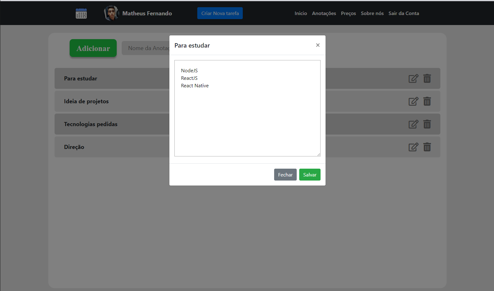

<h1 align="center">
   Agende-se

 

<h3>

Hospedado em [Agende-se](https://agende-se-116d9.firebaseapp.com/)

</h3>
</h1>

 

- O que é o site?

  > Site desenvolvido afim de colaborar para organização diária pessoal, ajudando em manter controle dos horarios disponíveis;

- Funcionalidades:

  > A principal funcionalidade se encontra na tela de inicio, onde temos o controle de através de um calendário em que podemos ver a quantidade de tarefas de cada dia do mes selecionado.

  > É possivel visualizar as tarefas no canto esquerdo em que podemos filtrar por dia, mês ou ver todos os eventos disponíveis. Marcar como concluído, editar ou excluir um evento também é possível.

  ### :camera: Exemplo:

  

  > Podemos fazer preview rápido das tarefas do dia.

  ### :camera: Exemplo:

  

  > Podemos fazer anotações como um bloco de notas online, organizando ideias ou o que for necessário.

  ### :camera: Exemplo:

   

  > Podemos definir eventos com data definida ou indefinidas, o qual o último é essencial quando for um evento de longo prazo sem uma data definida de execução.

  ## Tecnologias:

  - [x] Javascript(Puro)
  - [x] Firebase(Autenticação, Banco de dados)
